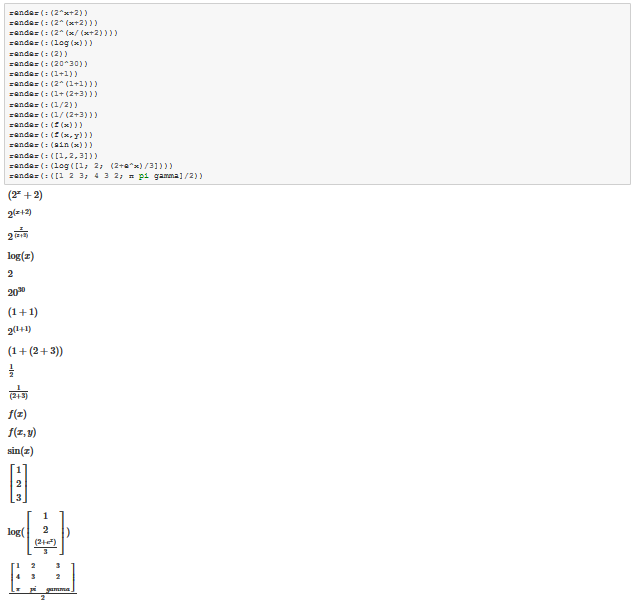
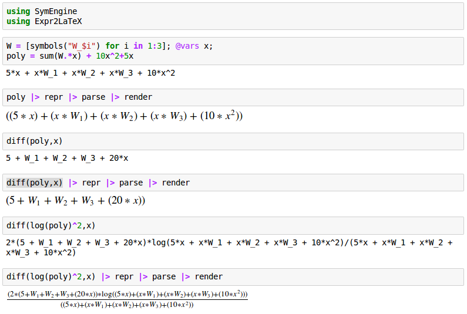

# Expr2LaTeX

Checkout [the IJulia Notebook for the Demo](http://nbviewer.jupyter.org/github/oxinabox/Expr2LaTeX.jl/blob/master/demo.ipynb)

### Use with SymEngine.jl

A particularly cool use of this is with [SymEngine.jl](https://github.com/symengine/SymEngine.jl).

`repr`ing  a SymEngine expression, outputs basically julia code.
You can `parse` this to get a julia expression,
and then you can use Expr2LaTeX to `render` it.

## See also
 
[Latexify.jl](https://github.com/korsbo/Latexify.jl),
same rough idea, but taken to the next level.
